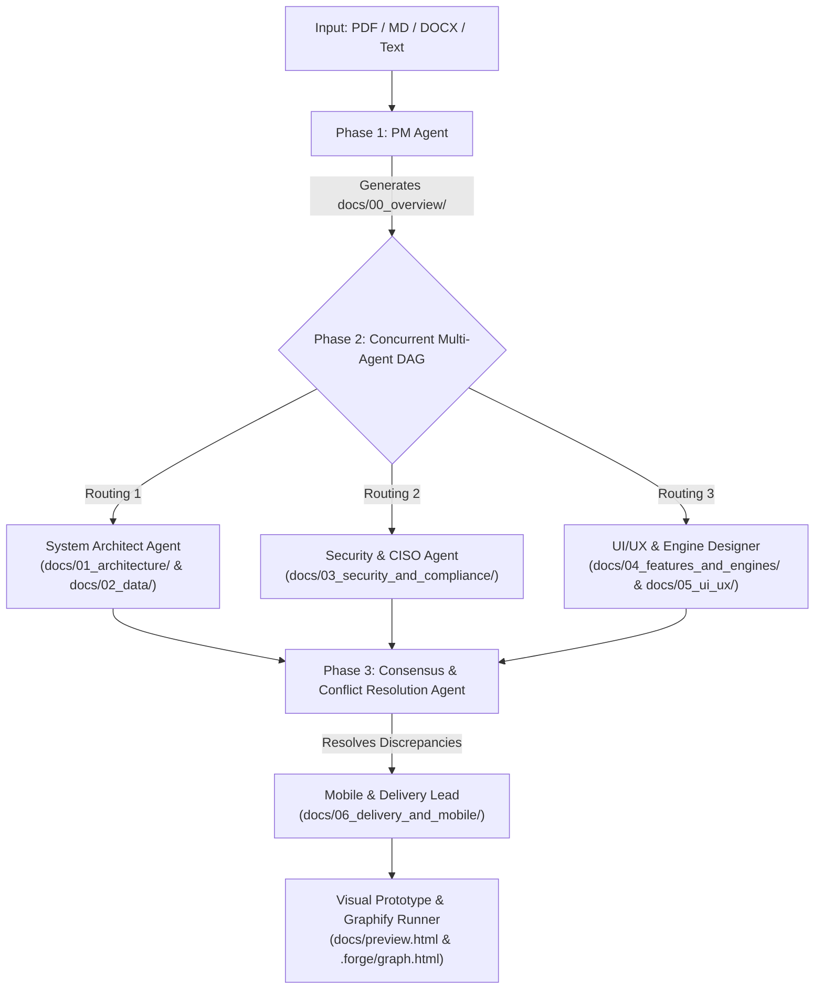

# Autonomous Spec-Forge Multi-Agent Pipeline

### Invocation Commands
Trigger this autonomous pipeline anytime using:
- `/forge <path-to-document>` (e.g., `/forge docs/requirements.pdf` or `/forge docs/specs.md`)
- `/spec-forge <path-to-document>`
- `@spec-forge <path-to-document>`
- Natural language: *"Run spec-forge on `<path>`"*

---

## 🏛️ Enterprise Hierarchical Documentation Mandate

> [!CRITICAL]
> **NO FLAT DOCUMENTATION POLICY**: You must NEVER output monolithic or flat numbered files in the root of `docs/`.
> Professional engineering standards require an organized, modular tree structure with specialized directories.
> You MUST scaffold and populate the exact directory tree below:

```text
docs/
├── 00_overview/
│   ├── prd.md                                # Executive summary, personas, P0/P1 scope, non-goals
│   └── architecture_tree.md                  # Complete sitemap & documentation navigation tree
│
├── 01_architecture/
│   ├── tech_stack_evaluation.md              # In-depth trade-off analysis (Backend, Frontend, Mobile, DB)
│   ├── network_adaptive_engine.md            # Real-time transport, bandwidth probing & degradation
│   ├── system_topology.md                    # C4 Container architecture & service boundaries
│   └── sequence_flows.md                     # End-to-end Mermaid transaction sequences
│
├── 02_data/
│   ├── schema.md                             # Production SQL DDL (PostgreSQL relational + JSONB models)
│   ├── data_pipelines.md                     # Redis pub/sub, ephemeral token grants, task queues
│   ├── fhir_r4_mappings.md                   # HL7 FHIR R4 resources & health standard serialization
│   └── storage_vault.md                      # Private encrypted S3/MinIO storage & proxy stream rules
│
├── 03_security_and_compliance/
│   ├── stride_threat_model.md                # STRIDE Threat Modeling matrix & concrete mitigations
│   ├── dpdp_and_disha_compliance.md          # Indian DPDP Act 2023, DISHA & Telemedicine Guidelines
│   └── consent_token_lifecycle.md            # HMAC-SHA256 tokens, Redis TTL, 1-click revocation
│
├── 04_features_and_engines/
│   ├── consent_engine.md                     # Purpose-specific, time-bound consent mechanics
│   ├── ddi_safety_engine.md                  # Deterministic CDSS & Drug-Drug Interaction rules
│   ├── multilingual_bhashini_engine.md       # Vernacular language layer & audio TTS architecture
│   ├── ai_clinical_scribe.md                 # Clinician-in-the-loop SOAP drafting & signature gates
│   └── patient_and_doctor_portals.md         # Detailed portal feature matrices & workflows
│
├── 05_ui_ux/
│   ├── design_system_tokens.md               # HSL color scales, typography line heights, spatial grid
│   └── screen_flows.md                       # Comprehensive screen-by-screen UX hierarchy
│
├── 06_delivery_and_mobile/
│   ├── pwa_to_apk_capacitor.md               # PWA-first strategy & Capacitor Android APK build pipeline
│   └── sprint_roadmap.md                     # 4-milestone hackathon to production delivery roadmap
│
└── preview.html                              # Standalone interactive visual prototype
```

---

## 🔄 Dynamic Subagent Routing & Concurrent Execution



---

## 📋 Strict Agent Role Specifications

### 1. PM Agent (`agents/pm_agent.md`)
- **Assigned Output Directory:** `docs/00_overview/`
- Dissects problem statement into quantified user stories, user persona matrices, and domain boundary rules.
- Produces `docs/00_overview/prd.md` and `docs/00_overview/architecture_tree.md`.

### 2. System Architect Agent (`agents/architect_agent.md`)
- **Assigned Output Directories:** `docs/01_architecture/` and `docs/02_data/`
- Performs comparative tech stack evaluation (e.g. Python FastAPI vs Node.js; React PWA vs Native; PostgreSQL vs Mongo).
- Designs system topology, C4 diagrams, sequence flows, and production-ready SQL DDL schemas.

### 3. Security & Compliance Agent (`agents/security_agent.md`)
- **Assigned Output Directory:** `docs/03_security_and_compliance/`
- Evaluates STRIDE threat matrix across every tier.
- Details regulatory frameworks (DPDP Act 2023, DISHA, HIPAA, PCI-DSS).
- Defines cryptographic HMAC token lifecycle and sub-millisecond revocation mechanics.

### 4. UI/UX & Engine Design Agent (`agents/uiux_agent.md`)
- **Assigned Output Directories:** `docs/04_features_and_engines/` and `docs/05_ui_ux/`
- Details design system tokens (calibrating vernacular line heights for Indian scripts like Kannada/Hindi).
- Defines core application engines (Consent engine, DDI safety engine, Bhashini multilingual TTS engine, AI clinical scribe).

### 5. Delivery & Consensus Agent (`agents/consensus_agent.md`)
- **Assigned Output Directory:** `docs/06_delivery_and_mobile/`
- Cross-audits all outputs for discrepancies (e.g., verifying UI data fields against API contracts).
- Details the PWA-to-Capacitor APK mobile build strategy and 4-milestone delivery timeline.
- Generates `docs/preview.html` and executes `tools/graph_mapper.js` to build `.forge/graph.html`.

> [!IMPORTANT]
> **Zero Micromanagement Policy**: Run through all phases autonomously. Do not stop to prompt the user after each stage. Assemble the complete enterprise documentation tree in one continuous execution.
