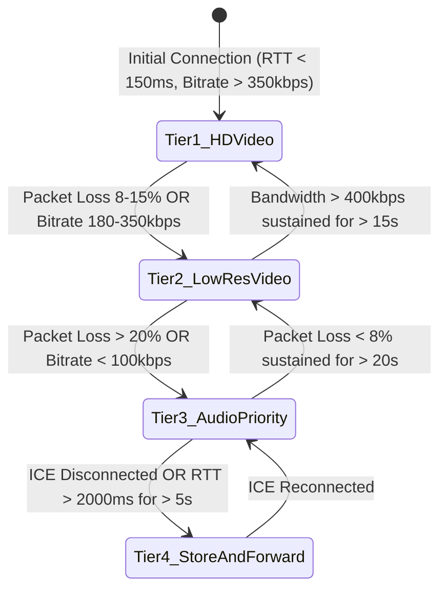

# WebRTC Network-Adaptive Telehealth Consultation Engine

**Document ID:** ARCH-NET-CB-2026-V1  
**Project:** CareBridge India  
**Scope:** Real-Time Media Transport, Quality Probing, and Application-Layer Degradation  

---

## 1. The Low-Bandwidth Telehealth Challenge in India

In non-urban Indian environments, cellular throughput fluctuates violently:
- Latency (RTT) fluctuates between 80ms and 2500ms.
- Packet loss ranges from 2% to 40% during cell tower handoffs.
- Standard WebRTC implementations attempt to maintain video resolution, resulting in frozen frames, severe audio robotic distortion, and eventual ICE connection drops.

CareBridge implements an **Active Network Quality Probe & Multi-Tier Degradation State Machine**.

---

## 2. Dynamic Degradation State Machine



---

## 3. Tier Specifications & Media Parameters

| Tier | Name | Target Bandwidth | Video Codec & Profile | Audio Codec & Bitrate | UI Visual State |
| :--- | :--- | :--- | :--- | :--- | :--- |
| **Tier 1** | HD Video & Audio | 350 – 800 kbps | VP8 / H.264 (720p @ 24fps) | Opus @ 32 kbps | Full duplex video tiles |
| **Tier 2** | Low-Res Video | 150 – 350 kbps | VP8 (360p @ 15fps, keyframe every 3s) | Opus @ 20 kbps | Subtle notification: *"Optimizing video for network"* |
| **Tier 3** | Audio Priority | 30 – 100 kbps | **Video Disabled** (`track.enabled = false`) | Opus Narrowband @ 16 kbps (FEC enabled) | Visual audio waveform; camera muted |
| **Tier 4** | Store-and-Forward | < 20 kbps / Offline | Offline | Pre-recorded voice note chunking (< 64KB) | Async text & audio message queue |

---

## 4. Client-Side Quality Probe Implementation

```typescript
// WebRTC Statistics Monitor running on client interval
export class AdaptiveWebRTCManager {
  private peerConnection: RTCPeerConnection;
  private currentTier: 1 | 2 | 3 | 4 = 1;

  constructor(pc: RTCPeerConnection) {
    this.peerConnection = pc;
    setInterval(() => this.evaluateConnectionQuality(), 2000);
  }

  private async evaluateConnectionQuality() {
    const stats = await this.peerConnection.getStats();
    let currentRtt = 0;
    let packetLoss = 0;

    stats.forEach(report => {
      if (report.type === 'candidate-pair' && report.state === 'succeeded') {
        currentRtt = report.currentRoundTripTime ? report.currentRoundTripTime * 1000 : 0;
      }
      if (report.type === 'inbound-rtp' && report.kind === 'video') {
        const packetsLost = report.packetsLost || 0;
        const packetsReceived = report.packetsReceived || 1;
        packetLoss = (packetsLost / (packetsLost + packetsReceived)) * 100;
      }
    });

    if (packetLoss > 20 || currentRtt > 1200) {
      this.transitionToTier3AudioPriority();
    } else if (packetLoss > 10 || currentRtt > 500) {
      this.transitionToTier2LowRes();
    }
  }

  private transitionToTier3AudioPriority() {
    if (this.currentTier === 3) return;
    this.currentTier = 3;
    const senders = this.peerConnection.getSenders();
    const videoSender = senders.find(s => s.track && s.track.kind === 'video');
    if (videoSender && videoSender.track) {
      videoSender.track.enabled = false; // Mute video track to preserve audio packet delivery
    }
    window.dispatchEvent(new CustomEvent('carebridge:network-degraded', { detail: { mode: 'audio' } }));
  }
}
```
