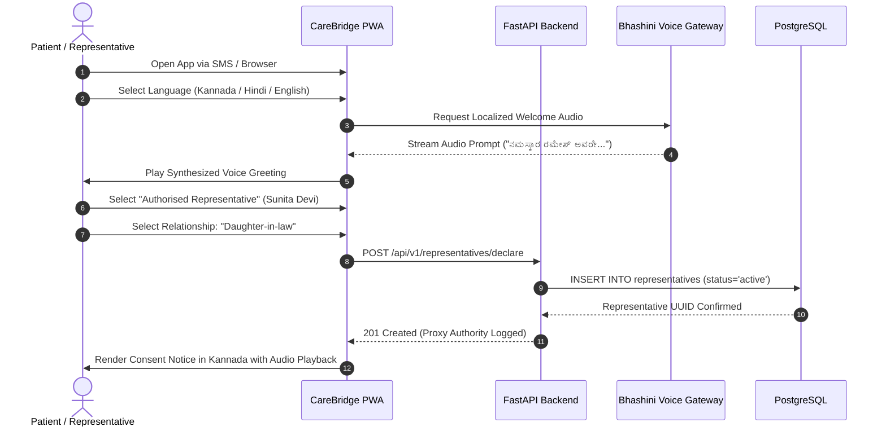
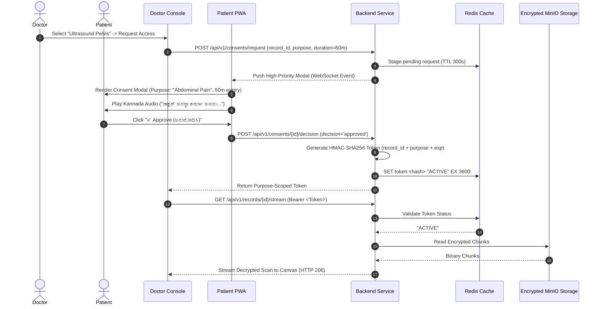
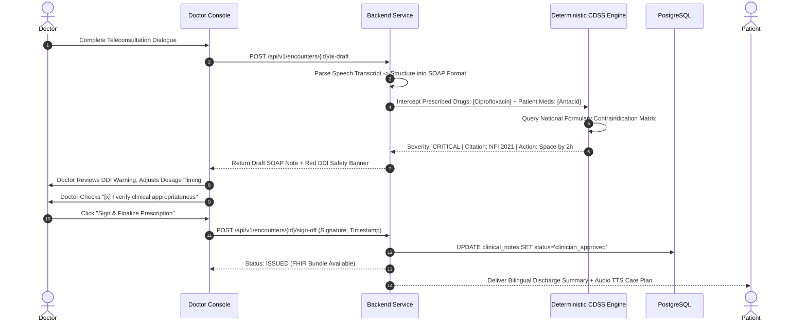

# End-to-End System Sequence Flows

**Document ID:** ARCH-SEQ-CB-2026-V1  
**Project:** CareBridge India  
**Scope:** Interactive Transaction Sequences for All Clinical & Consent Workflows  

---

## 1. Flow 1: Patient Ingestion, Vernacular Audio & Representative Check

---

## 2. Flow 2: Purpose-Specific Consent & Decrypted Record Streaming

---

## 3. Flow 3: AI Documentation, DDI Interception & Clinician Sign-off

