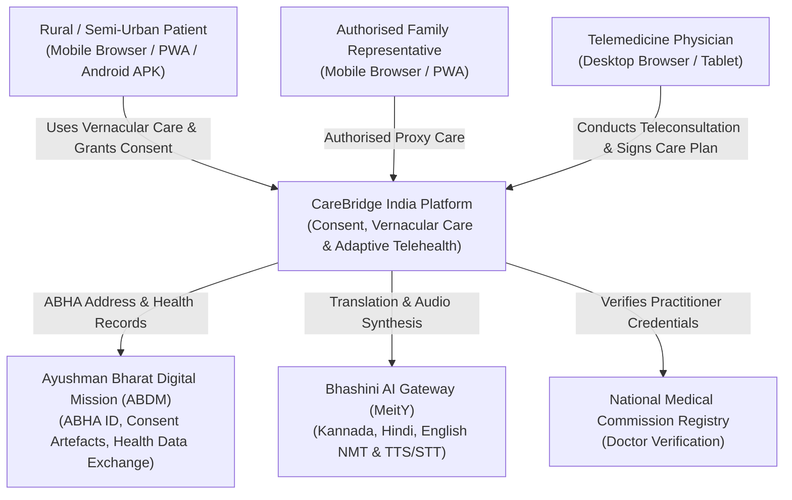
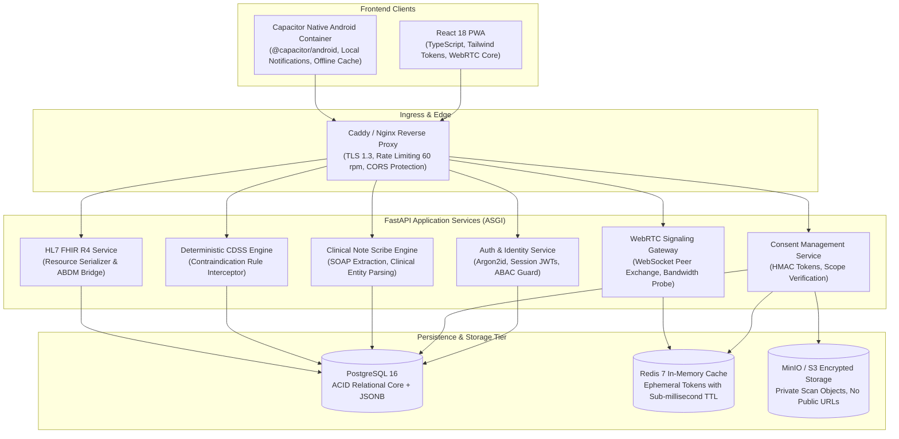

# System Topology & Service Boundaries (C4 Model)

**Document ID:** ARCH-TOPO-CB-2026-V1  
**Project:** CareBridge India  
**Standard:** C4 Architectural Modeling (Context, Container, Component)  

---

## 1. Level 1: System Context Diagram

---

## 2. Level 2: Container Diagram (Logical Architecture)

---

## 3. Service Boundaries & Communication Protocols

| Service Name | Primary Protocol | Auth Mechanism | Dependency |
| :--- | :--- | :--- | :--- |
| **Auth & Identity** | HTTPS / REST | Argon2id + Bearer JWT | PostgreSQL (`users`, `representatives`) |
| **Consent Service** | HTTPS / REST + SSE | Purpose-Scoped HMAC-SHA256 | Redis (TTL 3600s) + PostgreSQL (`consents`) |
| **WebRTC Signaling** | Secure WebSockets (`wss://`) | Session JWT | Redis (room states & ICE candidates) |
| **AI Scribe & CDSS** | HTTPS / Async ASGI | Clinician JWT | National Formulary Dataset |
| **Record Stream Proxy** | HTTPS Stream (`chunked`) | Purpose-Scoped Grant Token | MinIO / S3 Private Storage |
