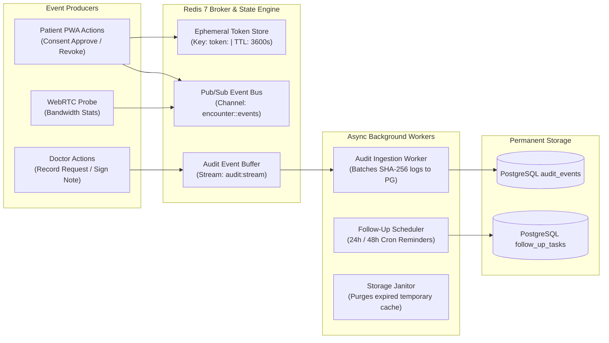

# Real-Time Data Pipelines & Async Event Processing

**Document ID:** DATA-PIPE-CB-2026-V1  
**Project:** CareBridge India  
**Stack:** Redis 7 (Pub/Sub + Streams + TTL), Celery / ARQ (Async Tasks), PostgreSQL 16 (Append-Only Event Store)  

---

## 1. High-Level Data Pipeline Topology



---

## 2. Event Types & Stream Payloads

### 2.1 Consent Life-Cycle Events (`audit:stream`)
```json
{
  "event_id": "evt_771928a0",
  "event_type": "CONSENT_GRANTED",
  "actor_id": "patient_ramesh_kn",
  "actor_role": "patient",
  "resource_id": "usg_pelvis_scan_may2026",
  "purpose": "Acute Flank Pain Assessment",
  "granted_to": "practitioner_ananya_sharma",
  "duration_seconds": 3600,
  "timestamp": "2026-10-02T16:45:00.120Z",
  "ip_hash": "a1b2c3d4e5f6...",
  "user_agent": "Mozilla/5.0 (Android PWA)"
}
```

### 2.2 Follow-Up Automated Reminders Pipeline
1. When an encounter is marked `COMPLETED`, a background job schedules a check-in task at $T + 24\text{h}$ and $T + 48\text{h}$.
2. At the scheduled time, the notification worker dispatches:
   - SMS / WhatsApp interactive template in the patient's language (**Kannada** or **Hindi**).
   - Audio voice link for one-click spoken instruction playback.
3. If the patient replies `[Need Doctor Help 🚨]`, the task is immediately flagged with `triage_alert_flag = true`, pushing a priority notification onto Dr. Ananya's consultation queue.
