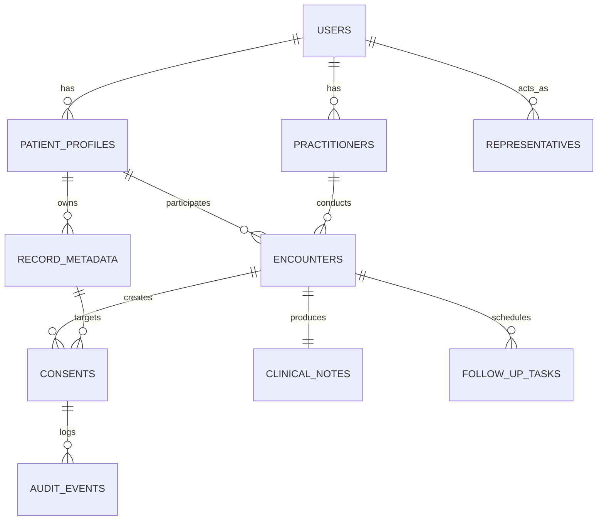

# Relational Database Schema & Data Modeling

**Document ID:** DATA-SCHEMA-CB-2026-V1  
**Target Engine:** PostgreSQL 16 (Relational + JSONB)  
**ORM / Migration Engine:** SQLAlchemy 2.0 (Async) + Alembic  

---

## 1. Entity-Relationship Overview



---

## 2. Table Definitions & DDL

```sql
-- Core Schema DDL
CREATE TABLE users (
    user_id UUID PRIMARY KEY DEFAULT gen_random_uuid(),
    role VARCHAR(20) NOT NULL CHECK (role IN ('patient', 'practitioner', 'admin', 'representative')),
    login_identifier VARCHAR(100) UNIQUE NOT NULL,
    password_hash VARCHAR(255) NOT NULL,
    status VARCHAR(20) DEFAULT 'active',
    created_at TIMESTAMPTZ DEFAULT CURRENT_TIMESTAMP
);

CREATE TABLE patient_profiles (
    patient_id UUID PRIMARY KEY REFERENCES users(user_id) ON DELETE CASCADE,
    preferred_language VARCHAR(10) DEFAULT 'kn' CHECK (preferred_language IN ('kn', 'hi', 'en')),
    full_name VARCHAR(150) NOT NULL,
    abha_address VARCHAR(100) UNIQUE,
    demographics_json JSONB DEFAULT '{}'::jsonb, -- Minimized: { age, sex, district }
    created_at TIMESTAMPTZ DEFAULT CURRENT_TIMESTAMP
);

CREATE TABLE practitioners (
    practitioner_id UUID PRIMARY KEY REFERENCES users(user_id) ON DELETE CASCADE,
    display_name VARCHAR(150) NOT NULL,
    registration_number VARCHAR(50) NOT NULL,
    specialty VARCHAR(100) NOT NULL,
    credential_status VARCHAR(20) DEFAULT 'verified',
    created_at TIMESTAMPTZ DEFAULT CURRENT_TIMESTAMP
);

CREATE TABLE representatives (
    representative_id UUID PRIMARY KEY DEFAULT gen_random_uuid(),
    patient_id UUID NOT NULL REFERENCES patient_profiles(patient_id),
    representative_user_id UUID NOT NULL REFERENCES users(user_id),
    relationship VARCHAR(50) NOT NULL, -- 'daughter', 'son', 'spouse', 'guardian'
    authority_status VARCHAR(20) DEFAULT 'active' CHECK (authority_status IN ('active', 'revoked')),
    created_at TIMESTAMPTZ DEFAULT CURRENT_TIMESTAMP
);

CREATE TABLE encounters (
    encounter_id UUID PRIMARY KEY DEFAULT gen_random_uuid(),
    patient_id UUID NOT NULL REFERENCES patient_profiles(patient_id),
    practitioner_id UUID REFERENCES practitioners(practitioner_id),
    start_time TIMESTAMPTZ DEFAULT CURRENT_TIMESTAMP,
    end_time TIMESTAMPTZ,
    mode VARCHAR(20) DEFAULT 'video' CHECK (mode IN ('video', 'audio', 'text_async')),
    status VARCHAR(20) DEFAULT 'queued' CHECK (status IN ('queued', 'in_progress', 'completed')),
    symptoms_text TEXT,
    allergies_json JSONB DEFAULT '[]'::jsonb,
    current_meds_json JSONB DEFAULT '[]'::jsonb
);

CREATE TABLE record_metadata (
    record_id UUID PRIMARY KEY DEFAULT gen_random_uuid(),
    patient_id UUID NOT NULL REFERENCES patient_profiles(patient_id),
    record_type VARCHAR(50) NOT NULL, -- 'ultrasound', 'blood_panel', 'prescription'
    title VARCHAR(200) NOT NULL,
    file_mime_type VARCHAR(50) NOT NULL,
    file_size_bytes BIGINT NOT NULL,
    secure_storage_reference VARCHAR(500) NOT NULL, -- S3/MinIO private URI
    encryption_key_id VARCHAR(100) NOT NULL,
    created_at TIMESTAMPTZ DEFAULT CURRENT_TIMESTAMP
);

CREATE TABLE consents (
    consent_id UUID PRIMARY KEY DEFAULT gen_random_uuid(),
    encounter_id UUID NOT NULL REFERENCES encounters(encounter_id),
    patient_id UUID NOT NULL REFERENCES patient_profiles(patient_id),
    practitioner_id UUID NOT NULL REFERENCES practitioners(practitioner_id),
    record_id UUID NOT NULL REFERENCES record_metadata(record_id),
    purpose VARCHAR(255) NOT NULL,
    scope VARCHAR(50) DEFAULT 'read_only' CHECK (scope IN ('read_only', 'download')),
    status VARCHAR(20) DEFAULT 'requested' CHECK (status IN ('requested', 'approved', 'declined', 'revoked', 'expired')),
    expires_at TIMESTAMPTZ NOT NULL,
    created_at TIMESTAMPTZ DEFAULT CURRENT_TIMESTAMP
);

CREATE TABLE audit_events (
    event_id UUID PRIMARY KEY DEFAULT gen_random_uuid(),
    actor_id UUID NOT NULL,
    action VARCHAR(50) NOT NULL,
    resource_id UUID NOT NULL,
    outcome VARCHAR(20) NOT NULL CHECK (outcome IN ('SUCCESS', 'DENIED', 'EXPIRED')),
    ip_hash VARCHAR(64) NOT NULL,
    timestamp TIMESTAMPTZ DEFAULT CURRENT_TIMESTAMP
);
```
