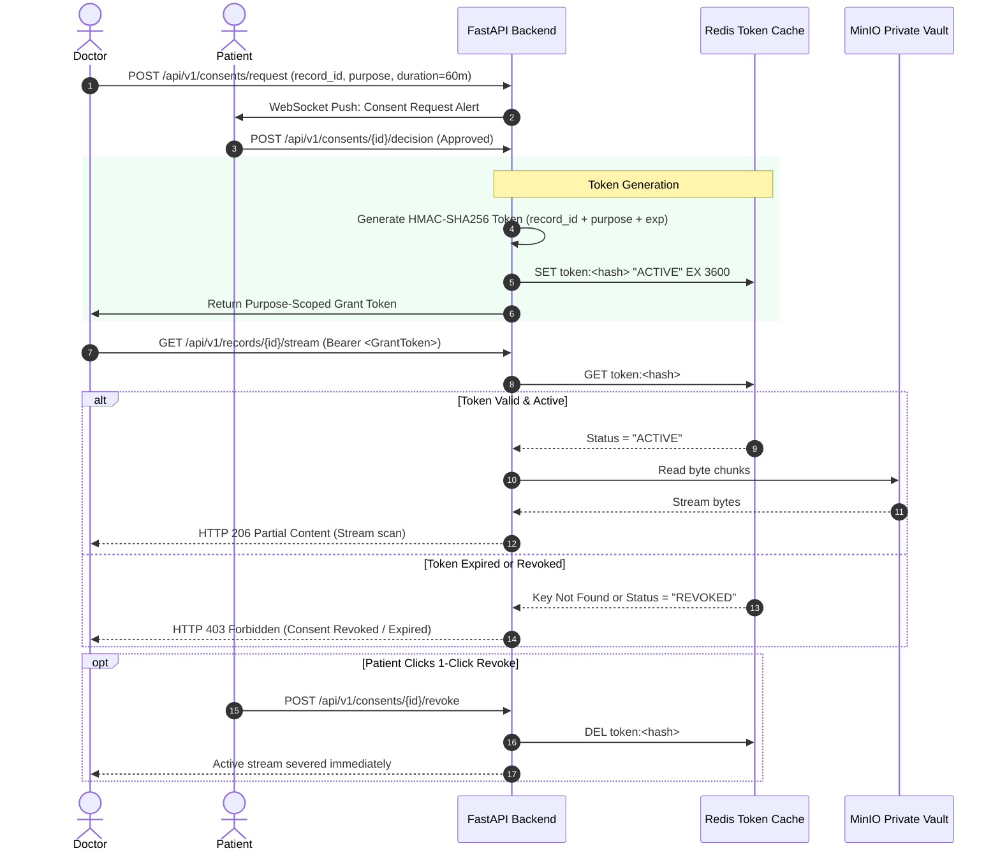

# Purpose-Bound Consent Token Lifecycle & Revocation Mechanics

**Document ID:** SEC-TOKEN-CB-2026-V1  
**Project:** CareBridge India  
**Enforcement:** Cryptographic HMAC-SHA256 Tokenization + Redis Sub-Millisecond Revocation  

---

## 1. The Critical Distinction: Consent UI vs. Backend Enforcement

In many telemedicine prototypes, consent is a superficial checkbox on the front end. If an attacker crafts a raw HTTP GET request to `/api/records/patient123/scan.pdf`, the server returns the file.

**CareBridge Enforces Cryptographic Token Isolation:**
A doctor's session token alone **CANNOT** decrypt or read a patient's records. A separate, ephemeral, single-purpose **Consent Grant Token** must accompany the request.

---

## 2. Token Lifecycle Diagram



---

## 3. Cryptographic Token Payload

```json
{
  "token_type": "carebridge_consent_grant",
  "consent_id": "c7a82910-14e2-416b-b2bb-182390a8e100",
  "practitioner_id": "dr_ananya_sharma",
  "patient_id": "ramesh_gowda",
  "record_id": "usg_abdomen_may2026",
  "purpose": "Acute Flank Pain Assessment",
  "access_scope": "stream_only",
  "issued_at": 1727892000,
  "expires_at": 1727895600,
  "hmac_signature": "e3b0c44298fc1c149afbf4c8996fb92427ae41e4649b934ca495991b7852b855"
}
```
