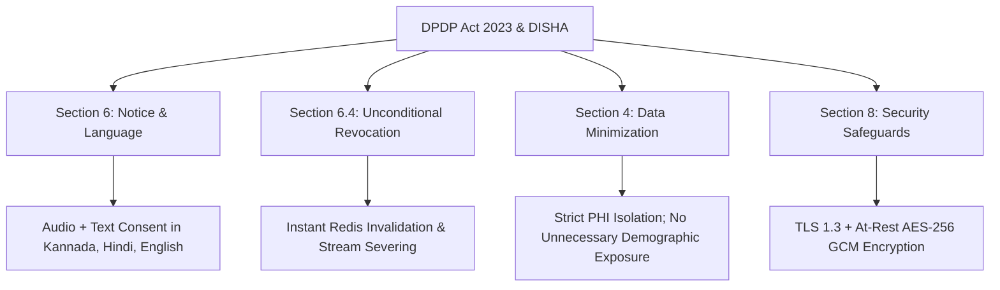

# Regulatory Compliance: Indian DPDP Act 2023 & DISHA Guidelines

**Document ID:** SEC-COMPLY-CB-2026-V1  
**Project:** CareBridge India  
**Applicable Statutes:** Digital Personal Data Protection Act 2023 (DPDP Act), DISHA (Digital Information Security in Healthcare Act), Telemedicine Practice Guidelines (2020)  

---

## 1. Compliance Requirements & CareBridge Architectural Mapping

### 1.1 Notice in Scheduled Languages (Section 6, DPDP Act 2023)
- The DPDP Act stipulates that consent notices must be provided in the languages specified in the Eighth Schedule to the Constitution.
- **CareBridge Implementation:** The system delivers pre-consultation and record-request consent notices in **Kannada**, **Hindi**, and **English**, accompanied by automated speech synthesis for low-literacy users.

### 1.2 Unconditional Right to Withdraw (Section 6(4))
- A patient can withdraw consent as easily as it was given.
- **CareBridge Implementation:** A prominent `[Revoke Access]` button in the patient portal triggers immediate deletion of the temporary access key from Redis, instantly blocking any subsequent read requests by the doctor.

### 1.3 Telemedicine Practice Guidelines (NMC India)
- Prescriptions must include doctor registration numbers and qualification details.
- Clinicians must explicitly verify patient identity and consent before prescribing.
- AI scribes cannot act as autonomous prescribers; all recommendations remain strictly advisory drafts.
