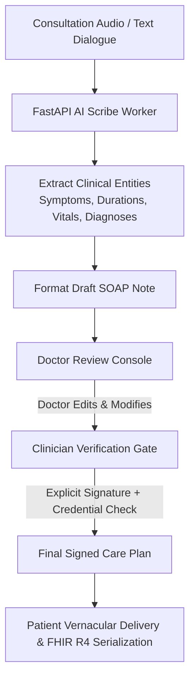

# AI Clinical Scribe & Clinician Review Gate

**Document ID:** FEAT-SCRIBE-CB-2026-V1  
**Project:** CareBridge India  
**Scope:** Automated SOAP Note Generation & Clinician Approval Gate  

---

## 1. Clinician-in-the-Loop Architecture

The CareBridge AI Scribe converts spoken consultation audio into structured **SOAP (Subjective, Objective, Assessment, Plan)** notes.



---

## 2. SOAP Note Structure

```json
{
  "encounter_id": "enc_9481",
  "subjective": "54-year-old male presenting with colicky right flank pain radiating to groin for 3 days. Denies gross hematuria. Mild nausea, no vomiting.",
  "objective": "T: 98.4°F, BP: 130/84 mmHg. Abdomen: Soft, tenderness in right renal angle. Ultrasound: 4mm right distal ureteric calculus with mild hydronephrosis.",
  "assessment": "Acute uncomplicated right ureteric colic (ICD-10: N20.1).",
  "plan": {
    "medications": [
      { "drug": "Tamsulosin", "dosage": "0.4mg", "frequency": "OD at bedtime", "duration": "14 days" },
      { "drug": "Paracetamol", "dosage": "650mg", "frequency": "SOS for pain", "duration": "5 days" }
    ],
    "dietary_advice": "Hydration therapy (3L water daily); avoid excessive oxalates.",
    "red_flags": "Immediate ER visit if high-grade fever, chills, or inability to pass urine occurs."
  }
}
```

---

## 3. Mandatory Clinician Approval Gate
Under the **National Medical Commission (NMC) Telemedicine Practice Guidelines**, prescriptions generated solely by AI without physician review are illegal.

The backend enforces this constraint by rejecting any attempt to transition an encounter to `COMPLETED` unless:
1. `clinical_notes.status = 'clinician_approved'`.
2. `clinical_notes.clinician_signature` contains a valid cryptographic signature timestamp.
