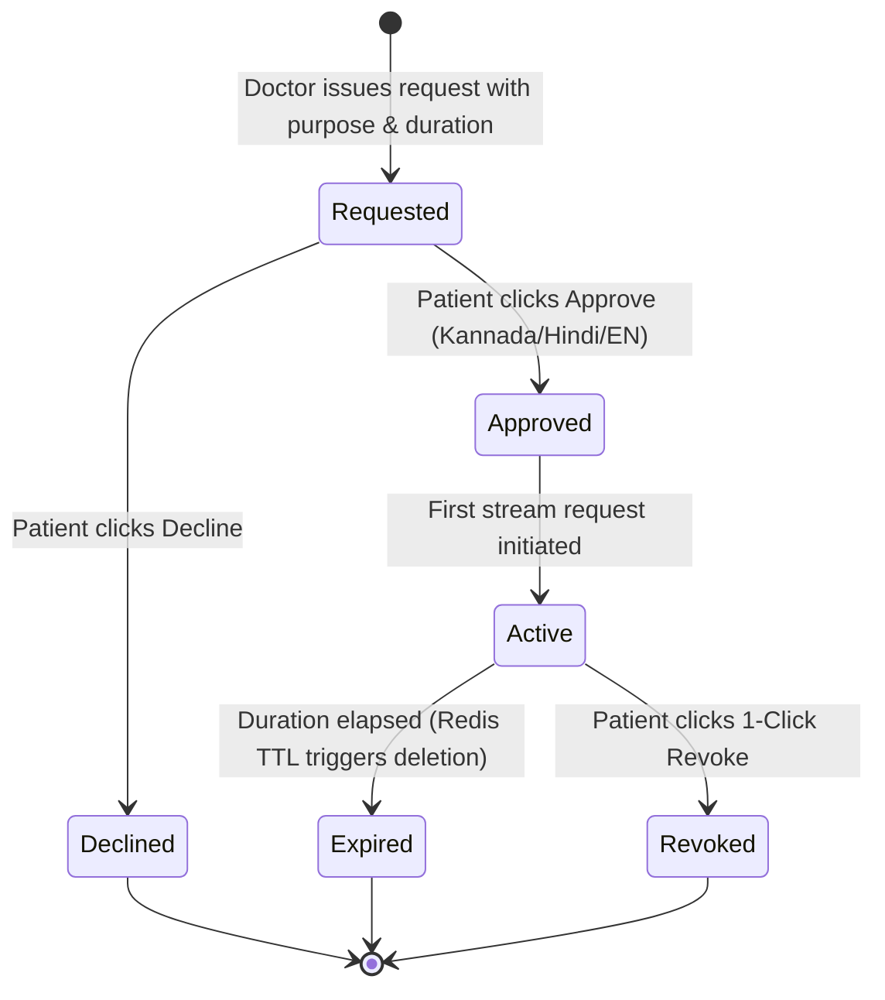

# Purpose-Specific Consent Engine & Policy Validator

**Document ID:** FEAT-CONSENT-CB-2026-V1  
**Project:** CareBridge India  
**Scope:** Policy Grammar, Granular Scoping, and Expiration State Machine  

---

## 1. Consent Policy Grammar

Traditional consent models in telemedicine are binary. CareBridge models consent as a **5-tuple policy**:

$$\text{ConsentPolicy} = \langle \text{Subject}, \text{Actor}, \text{Resource}, \text{Purpose}, \text{TemporalConstraint} \rangle$$

Where:
- **$\text{Subject}$:** Patient UUID (`patient_ramesh_gowda`)
- **$\text{Actor}$:** Verified Practitioner UUID (`dr_ananya_sharma`)
- **$\text{Resource}$:** Specific Record UUID (`usg_pelvis_scan_may2026`)
- **$\text{Purpose}$:** Explicit SNOMED/Clinical Code (`Acute Flank Pain Assessment`)
- **$\text{TemporalConstraint}$:** Expiry timestamp ($T_{\text{now}} + \Delta t$, where $\Delta t \in \{60\text{m}, 120\text{m}, 24\text{h}\}$)

---

## 2. Granular States & Lifecycle Management

### 2.1 Why a Consent Screen Alone is Not Security Enforcement
A consent prompt displayed in the front end means nothing if the underlying API does not validate tokens on every read. CareBridge ties every byte stream directly to the Redis TTL key. Once the key expires or is deleted by the patient, the stream terminates mid-transit.
