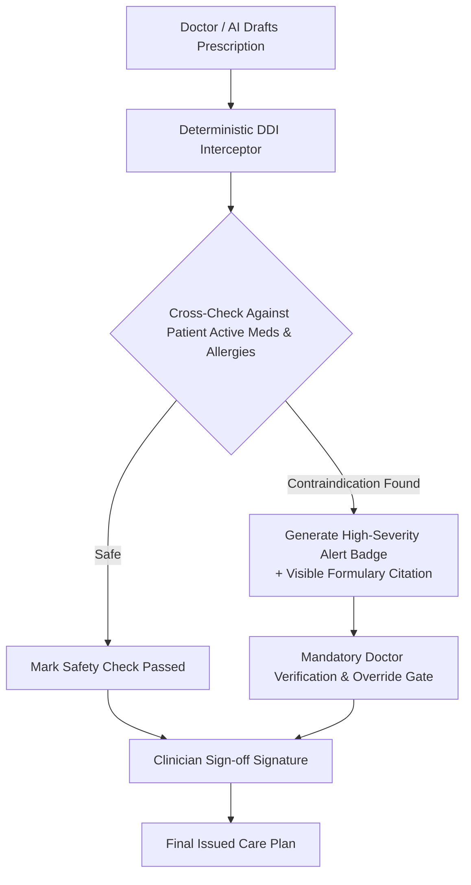

# Clinical Decision Support & Deterministic Drug-Drug Interaction (DDI) Engine

**Document ID:** CDSS-DDI-CB-2026-V1  
**Project:** CareBridge India  
**Standard:** National Formulary of India (NFI) / WHO Essential Medicines  

---

## 1. Safety Architecture: Why LLMs Must Never Prescribe Autonomously

Using a large language model (LLM) alone to validate clinical drug dosages and contraindications introduces critical risk of hallucination.

**CareBridge Enforces a Two-Tier Safety Protocol:**
1. **Tier 1 (AI Scribe):** The LLM is restricted solely to transcription and structuring spoken doctor-patient dialogue into standard SOAP format (Subjective, Objective, Assessment, Plan).
2. **Tier 2 (Deterministic CDSS Rule Engine):** All proposed medications are intercepted by a deterministic rule engine that cross-references a verified drug contraindication database before the prescription can be presented to the doctor.

---

## 2. Seeded Verified Contraindication Rules (Prototype Dataset)

| Drug Pair | Severity | Clinical Mechanism | Clinical Citation | Recommended Action |
| :--- | :--- | :--- | :--- | :--- |
| **Ciprofloxacin + Magnesium Antacids** | **CRITICAL** | Chelation reduces fluoroquinolone absorption by >70% | National Formulary of India (NFI) 2021 | Space doses by at least 2 hours or substitute antibiotic |
| **Metformin + Iodinated Radiocontrast** | **HIGH** | Risk of contrast-induced nephropathy and lactic acidosis | Indian College of Radiology Guidelines | Withhold metformin 48h prior to and after contrast imaging |
| **ACE Inhibitor + Spironolactone** | **HIGH** | Synergistic potassium retention causing severe hyperkalemia | WHO Formulary / Cardiological Society of India | Monitor serum potassium within 72 hours; adjust dosage |
| **Warfarin + NSAIDs (Ibuprofen)** | **CRITICAL** | Severe synergistic GI bleeding and platelet inhibition | NFI / British National Formulary (BNF) | Substitute with Paracetamol for analgesia |

---

## 3. Clinician Sign-off Gate
The CareBridge UI explicitly prohibits automatic prescription dispatch. The doctor must check an explicit confirmation box:
`[x] I have reviewed the DDI safety warning and verified the clinical appropriateness of this dosage.`
