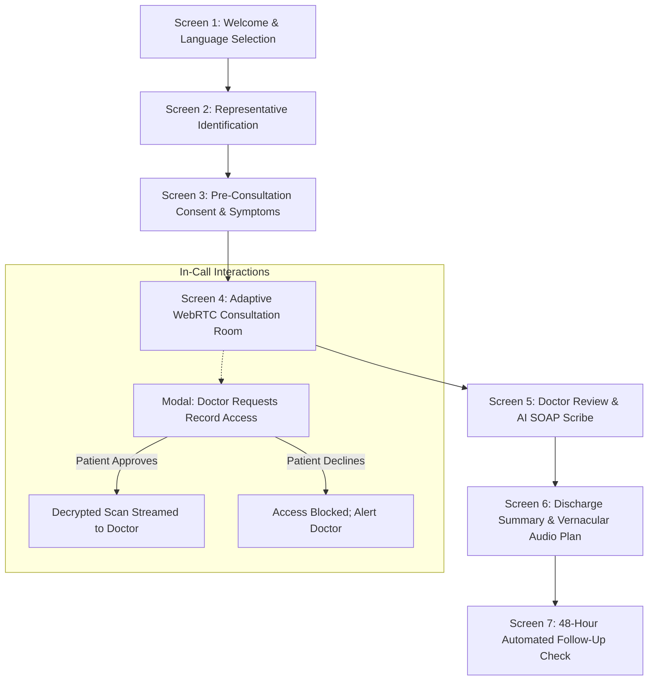

# Screen-by-Screen User Journey Flows & Interaction Specifications

**Document ID:** UI-FLOWS-CB-2026-V1  
**Project:** CareBridge India  
**Scope:** Complete User Journeys, Modal States, and Error Handlers  

---

## 1. Master Screen Flowchart

---

## 2. Detailed Screen Specifications

### Screen 1: Welcome & Language Selection
- **Hero Banner:** *"CareBridge India — ಸುಲಭ, ಸುರಕ್ಷಿತ ಆರೋಗ್ಯ ಸೇವೆ"*
- **Language Chips:** Large, thumb-friendly buttons: `[ಕನ್ನಡ (Kannada)]`, `[हिन्दी (Hindi)]`, `[English]`.
- **Audio Affordance:** Prominent green pill: `🔊 Listen to instructions in selected tongue`.

### Screen 2: Representative Authority Check
- **Toggle Options:**
  - `(o) I am the patient (ನಾನೇ ರೋಗಿ)`
  - `( ) I am an authorised representative (ಅಧಿಕೃತ ಪ್ರತಿನಿಧಿ)`
- If Representative:
  - Input field for Representative Name & Relationship dropdown (`Daughter/Son`, `Spouse`, `Legal Guardian`).

### Screen 3: Pre-Consultation Consent & Records
- Displays consultation scope and data minimization summary.
- List of ABDM-linked health records with individual status badges (`🔒 Protected`).

### Screen 4: Adaptive Telehealth Room
- Top network status badge:
  - 🟢 `Good Network (HD Video 450 kbps)`
  - 🟡 `Weak Network (Audio Priority 50 kbps)`
  - 🔴 `Store & Forward Async (<20 kbps)`
- In-call controls: Mic Mute, Video Toggle, End Call.

### Screen 5: Purpose-Specific Consent Modal
- High-priority modal overlay:
  - Doctor Name & Medical Registration Number.
  - Requested Record Title (e.g. *Ultrasound Pelvis & Abdomen*).
  - Explicit Clinical Purpose (e.g. *Evaluating suspected renal calculus*).
  - Auto-Expiry Timer: *60 minutes*.
  - Big action buttons: `[ ❌ Decline (ತಿರಸ್ಕರಿಸಿ) ]` vs. `[ ✅ Approve (ಅನುಮೋದಿಸಿ) ]`.

### Screen 6: Patient Discharge Plan
- Prescribed medications with dosage iconography (morning ☀️, afternoon 🌤️, night 🌙).
- Audio button: Plays Kannada/Hindi speech synthesis of complete doctor instructions.
- 48-hour follow-up response card: `[Feeling Better 😊]`, `[No Change 😐]`, `[Need Help 🚨]`.
