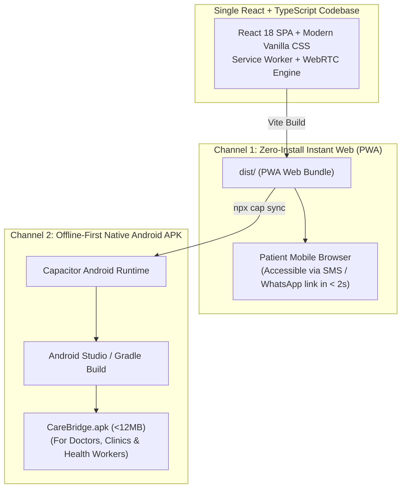

# Mobile Delivery Architecture: React PWA to Android APK via Capacitor

**Document ID:** MOB-CAPACITOR-CB-2026-V1  
**Project:** CareBridge India  
**Bridge Engine:** Capacitor 6.0 (`@capacitor/core`, `@capacitor/android`, `@capacitor/camera`, `@capacitor/local-notifications`)  

---

## 1. Architectural Strategy: The Progressive Dual-Channel Funnel

To reach both casual rural patients and dedicated community health workers (ASHAs/ANMs), CareBridge employs a **Dual-Channel Delivery Model**:



---

## 2. Why Capacitor Over React Native or Flutter for this Architecture

1. **100% Code Reuse:** React Native and Flutter require separate mobile UI components (`<View>`, `Widget`) that cannot easily be rendered in standard mobile web browsers via an SMS link. Capacitor wraps the exact same responsive React DOM.
2. **Instant Consultation Access:** A patient in rural Karnataka cannot wait for a 45MB Flutter app to download over an intermittent 3G connection just to start an urgent teleconsultation. They click an SMS link, the PWA opens in Chrome/Safari in 1.5 seconds, and WebRTC connects immediately.
3. **Native Hardware Access for APK:** When packaged as an APK using Capacitor, the app gains native device superpowers:
   - `@capacitor/camera`: Document scanning with flash and edge detection for uploading lab reports.
   - `@capacitor/local-notifications`: High-priority follow-up reminders even if the browser tab is closed.
   - `@capacitor/network`: Low-level cellular signal monitoring to feed the WebRTC degradation engine.

---

## 3. Step-by-Step Build Pipeline: Packaging PWA into Android APK

### Step 1: Install Capacitor Dependencies
```bash
npm install @capacitor/core @capacitor/cli @capacitor/android @capacitor/camera @capacitor/local-notifications
```

### Step 2: Initialize Capacitor Configuration (`capacitor.config.json`)
```json
{
  "appId": "in.gov.carebridge.app",
  "appName": "CareBridge India",
  "webDir": "dist",
  "server": {
    "androidScheme": "https"
  },
  "plugins": {
    "LocalNotifications": {
      "smallIcon": "ic_stat_carebridge",
      "iconColor": "#0B63E5"
    }
  }
}
```

### Step 3: Add Android Platform & Sync Web Assets
```bash
npm run build
npx cap add android
npx cap sync android
```

### Step 4: Build Standalone Debug & Release APK
```bash
cd android
# Build universal APK for low-cost Android smartphones (ARMv7 / ARM64)
./gradlew assembleDebug
```
The output APK is generated at:
`android/app/build/outputs/apk/debug/app-debug.apk` (~9.8 MB)
