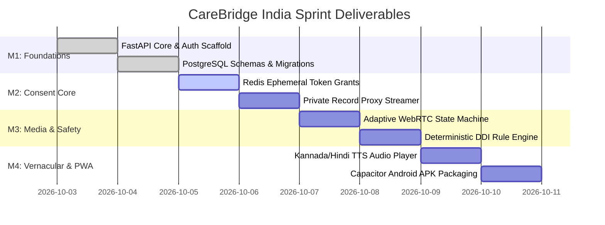

# Engineering Sprint Roadmap & Delivery Plan

**Document ID:** ROADMAP-SPRINT-CB-2026-V1  
**Project:** CareBridge India  
**Execution Horizon:** 4 Sequential Milestones (Hackathon Demo to Field Pilot)  

---

## 1. Master Delivery Timeline

---

## 2. Milestone Checkpoints & Acceptance Criteria

### Milestone 1: Foundations & Identity
- **Deliverable:** Working FastAPI ASGI server with async SQLAlchemy models for Users, Profiles, and Encounters.
- **Acceptance Gate:** Synthetic Patient (Ramesh) and Doctor (Dr. Ananya) can authenticate; patient declares self vs. authorized representative.

### Milestone 2: Purpose-Specific Consent Engine
- **Deliverable:** `/api/v1/consents/request` and `/decision` endpoints with Redis key expiration (TTL 3600s).
- **Acceptance Gate:** Doctor cannot view the ultrasound scan until the patient approves; access is revoked immediately upon user revocation.

### Milestone 3: WebRTC Adaptation & Clinical DDI Safety
- **Deliverable:** WebRTC signaling channel with active bandwidth probe that steps down from video to audio priority.
- **Acceptance Gate:** DDI engine flags Ciprofloxacin + Antacids with visible formulary citation; doctor cannot sign without explicit review.

### Milestone 4: Vernacular Audio & Mobile APK Release
- **Deliverable:** Kannada & Hindi speech prompts for consent notices and post-consultation instructions; Capacitor build script for Android.
- **Acceptance Gate:** App runs at 60fps on mobile browsers and compiles cleanly into `app-debug.apk` (<12MB).
